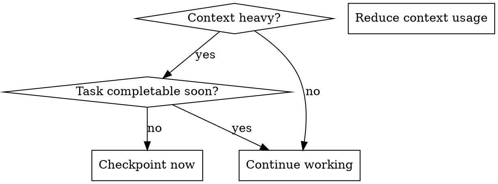

# Handling Context Exhaustion

## Overview

Recognize, prevent, and gracefully handle context window exhaustion during long-running tasks. This skill focuses on proactive checkpointing and efficient context management to avoid losing work when limits are reached.

**Announce at start:** "Using handling-context-exhaustion to checkpoint progress and manage context."

**Key distinction:** This skill is for mid-task context management. For resuming work after a session restart, see `harness:resuming-work`.

## When to Use

- Context usage is approaching limits (long conversation, many files read)
- Response quality is degrading (forgetting earlier context, repeating questions)
- Proactively during long-running implementation tasks
- Before starting work that will consume significant context

## Signs of Impending Exhaustion

Watch for these warning signs:

| Signal | Indicator |
|--------|-----------|
| Forgetting earlier context | Asking about things already discussed |
| Incomplete responses | Cutting off mid-thought or mid-code |
| Losing track of progress | Repeating completed work |
| Degraded reasoning | Missing obvious connections |
| Slower responses | Processing time increasing |

**Proactive triggers:**
- Reading 10+ files in a session
- Conversation exceeds 20+ exchanges
- Working on multi-phase implementation
- Debugging with extensive log output

## The Process

### Step 1: Assess Context State

Before proceeding with more work, evaluate:

```
Current context load:
- Files read: [count and names]
- Code written: [files modified]
- Tests run: [pass/fail status]
- Conversation depth: [exchange count]
```

### Step 2: Decide - Continue or Checkpoint



### Step 3: Reduce Context Usage (Prevention)

Before checkpointing, try reducing context consumption:

**Do:**
- Use `grep` to find specific content instead of reading entire files
- Summarize findings instead of keeping raw output in context
- Use subagents for independent subtasks (fresh context per agent)
- Close mental loops by summarizing conclusions
- Read only relevant sections of large files (use offset/limit)

**Avoid:**
- Reading the same file multiple times
- Keeping full test output when a summary suffices
- Storing verbose debug logs in context
- Reading entire codebases "for context"

### Step 4: Create Checkpoint

If continuing isn't viable, create a checkpoint:

**Location:** `.harness/NNN-feature-name/checkpoint.md`

**Checkpoint format:**

```markdown
# Context Checkpoint

**Created:** [timestamp]
**Feature:** [feature name from requirements]
**Branch:** [current branch name]

## Current Task
[What you were actively working on]

## Progress Summary
- [X] Task 1: [brief description]
- [X] Task 2: [brief description]
- [ ] Task 3: [IN PROGRESS - current task]
- [ ] Task 4: [pending]

## Files Modified (uncommitted)
- `path/to/file1.ts` - [what was changed]
- `path/to/file2.ts` - [what was changed]

## Test Status
- Last run: [pass/fail count]
- Failing tests: [list if any]
- Coverage: [if relevant]

## Key Context
[Critical information the next session needs to know - decisions made,
gotchas discovered, why certain approaches were chosen/rejected]

## Next Steps
1. [Immediate next action]
2. [Following action]
3. [And so on]

## Commands to Resume
\`\`\`bash
# Verify state
git status
git diff --stat

# Run tests to confirm state
npm test  # or appropriate test command

# Continue from here
[specific command or action]
\`\`\`
```

### Step 5: Commit In-Progress Work

Before ending the session:

```bash
# Stage all changes
git add -A

# Create WIP commit with context
git commit -m "WIP: [task description]

Progress: [X/Y tasks complete]
Next: [immediate next step]
Checkpoint: .harness/NNN-feature/checkpoint.md"
```

### Step 6: Inform User

Report to user with clear next steps:

```
⚠️ **Context limit approaching. Progress saved.**

- Checkpoint: `.harness/NNN-feature/checkpoint.md`
- Progress: Phase [N] of [M] complete (tracked via git)
- Branch: [current branch]

**Start a new session to continue.**

The session start hook will detect incomplete work from git
history and prompt you to resume.
```

## Context Reduction Strategies

### Use Subagents for Independent Work

Dispatch subagents for tasks that don't need your accumulated context:

```
Task("Implement the validation function in src/validators.ts per the spec")
```

Subagent gets fresh context, does focused work, returns result. Your context only grows by the summary.

### Grep Over Read

Instead of reading entire files to find something:

```bash
# Bad - consumes full file context
Read("src/huge-file.ts")

# Good - only consumes relevant lines
Grep(pattern="handleError", path="src/")
```

### Summarize, Don't Store

After analyzing something complex, summarize the conclusion:

```
After reviewing the 500-line auth module:
- Entry point: authenticateUser() at line 45
- Uses JWT with RS256 signing
- Token refresh handled in refreshToken() at line 120
- Bug likely in token validation (line 89-95)
```

Now you can drop the raw file content from working memory.

### Read File Sections

For large files, read only what you need:

```
Read(file_path="src/big-file.ts", offset=80, limit=50)  # Lines 80-130 only
```

### Close Investigation Loops

When investigating something, close the loop:

```
Investigation: Why does test X fail?
- Checked: module A (not the issue)
- Checked: module B (not the issue)
- Found: race condition in module C, line 45
- Root cause: async callback fires before state initialized

CONCLUSION: Fix by adding await before callback registration.
```

Now the investigation details can be forgotten; only the conclusion matters.

## When to Use Subagents

Dispatch subagents when:
- Task is independent (doesn't need conversation context)
- Task is well-defined (clear inputs and outputs)
- Fresh perspective would help (stuck on a problem)
- Context is heavy and task can be isolated

**Good subagent tasks:**
- Implementing a specific function to a spec
- Writing tests for a module
- Fixing a specific bug with clear reproduction
- Reviewing code for specific issues

**Bad subagent tasks:**
- Continuing nuanced design discussion
- Tasks requiring extensive context from conversation
- Tightly coupled work that needs coordination

## Handoff to New Session

When context is exhausted and checkpoint is complete:

1. Tell user: "Context limit approaching. Progress saved."
2. Reference: "Checkpoint at `.harness/NNN-feature/checkpoint.md`"
3. Instruction: "Start a new session - git history tracks your progress"

The `harness:using-harness` skill's session start hook scans git for
`phase(N): complete` commits and determines where you left off.

## Key Principles

- **Proactive over reactive** - Checkpoint before hitting limits, not after
- **Commit often** - WIP commits preserve state even if you forget to checkpoint
- **Summarize aggressively** - Conclusions over raw data
- **Use subagents liberally** - Fresh context is free, accumulated context is expensive
- **Close loops** - Finish investigations with clear conclusions

## Common Mistakes

| Mistake | Prevention |
|---------|------------|
| No checkpoint until too late | Checkpoint when context feels heavy, not when responses degrade |
| Checkpoint without committing | Always `git add -A && git commit` before ending |
| Too much detail in checkpoint | Focus on what's needed to resume, not everything that happened |
| Re-reading same files | Use grep, summarize findings, read sections |
| Not using subagents | Dispatch subagents for independent, well-defined tasks |
| Vague "next steps" | Be specific: "Run `npm test src/auth.test.ts` then fix line 45" |

## Integration with Other Skills

- **harness:using-harness** - Session start hook detects incomplete work via git history
- **harness:resuming-work** - Used by next session to read checkpoint and continue
- **harness:dispatching-parallel-agents** - Reduce context by parallelizing independent work
- **harness:subagent-driven-development** - Fresh subagent per Phase prevents context accumulation
- **harness:backlog-tracking** - Defer discovered issues to backlog instead of holding in context
