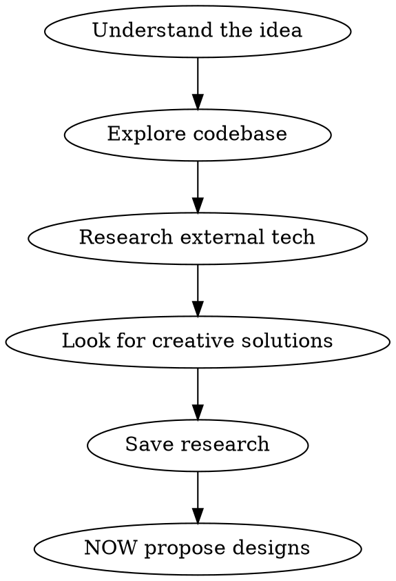
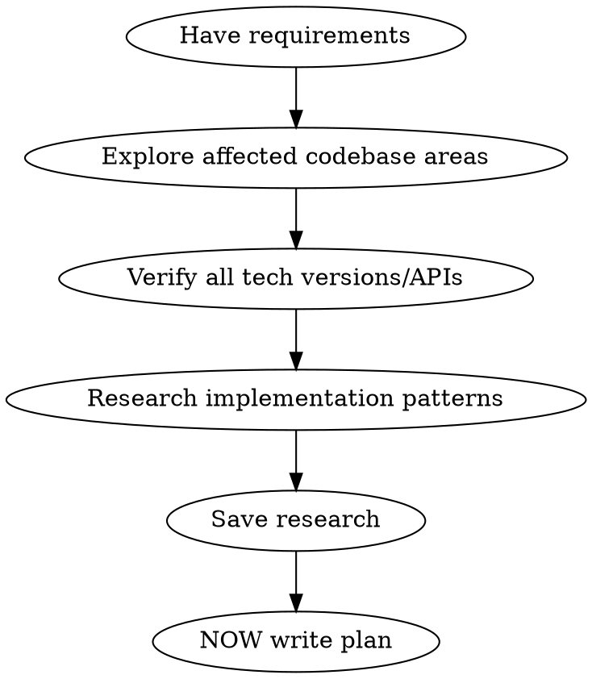

# Researching

## Overview

Research happens BEFORE design. Period.

Research = **Codebase Exploration** + **External Research**. Both are required. You cannot skip either.

**Announce at start:** "I'm using the researching skill to explore the codebase and gather current information before designing anything."

## The Iron Rule

```
NO DESIGNING UNTIL RESEARCH IS COMPLETE
```

This means:
- No proposing approaches
- No recommending architectures
- No writing implementation details
- No making technology choices

Until you have:
1. Explored the codebase thoroughly
2. Researched external technologies/APIs
3. Looked for creative solutions

## Red Flags - You're Skipping Research

| Thought | Reality |
|---------|---------|
| "I already know how this works" | Training data is stale. Verify. |
| "The codebase is simple" | Simple codebases have patterns you'll miss. Explore. |
| "I'll research as I go" | Research after design = rework. Research first. |
| "Just a quick design first" | NO. Research first, then design. |
| "I can see the pattern" | Seeing isn't knowing. Read the actual code. |
| "This is similar to X" | Similar isn't same. Verify current state. |
| "I'll check if needed" | You always need to check. That's the point. |
| "Let me propose something first" | NO. Research THEN propose. |

## The Research Process

### Phase 1: Codebase Exploration (REQUIRED)

**You cannot skip this.** Even if you "know" the codebase.

**What to explore:**

1. **Existing Patterns**
   - How is similar functionality implemented?
   - What abstractions exist?
   - What patterns are used (naming, structure, error handling)?

2. **Related Code**
   - What files touch the area you're working on?
   - What are the dependencies?
   - What might break if you change things?

3. **Tests**
   - How are similar features tested?
   - What testing patterns are used?
   - What edge cases are covered?

4. **Recent Changes**
   - What's been changed recently in this area?
   - Are there open PRs or recent commits to consider?
   - Is there ongoing refactoring?

**How to explore:**

```bash
# Find related files
glob "**/*relevant-keyword*"

# Search for patterns
grep "similar function or pattern"

# Check recent commits
git log --oneline -20 -- path/to/area

# Read related code
read actual files, don't assume
```

**Document what you find:**

```markdown
## Codebase Exploration

**Area:** [What part of codebase]
**Date:** YYYY-MM-DD

### Existing Patterns
- [Pattern 1]: Found in [files], used for [purpose]
- [Pattern 2]: ...

### Related Code
- [File/module]: [What it does, how it relates]

### Testing Approach
- Tests are in [location]
- Pattern used: [describe]

### Recent Activity
- [Relevant recent changes]

### Key Observations
- [Things that will affect the design]
```

### Phase 2: External Research (REQUIRED)

**For any external dependencies, APIs, or technologies:**

1. **Current Versions**
   - What's the latest stable version?
   - What breaking changes exist?
   - What's deprecated?

2. **API Signatures**
   - What are the actual method signatures?
   - What are the parameters and return types?
   - What errors can be thrown?

3. **Best Practices**
   - What does official documentation recommend?
   - What are common pitfalls?
   - What patterns are current?

4. **Creative Solutions**
   - What are OTHER ways to solve this?
   - What libraries exist for this problem?
   - What approaches haven't we considered?

**Use web search for:**

```
"[library name] latest version 2025"
"[library name] [feature] best practices"
"[problem domain] approaches comparison"
"how to [specific task] [technology]"
"[library name] vs [alternative] 2025"
```

**Document what you find:**

```markdown
## External Research

**Technologies:** [List]
**Date:** YYYY-MM-DD

### [Library/Framework Name]

**Current Version:** X.Y.Z (released YYYY-MM-DD)
**Documentation:** [URL]

**Key Findings:**
- [Important discovery]

**API Details:**
- [Relevant method signatures]

**Recommendations:**
- [What to use]

**Avoid:**
- [What's deprecated or problematic]

### Alternative Approaches Considered
- [Approach 1]: [Pros/cons]
- [Approach 2]: [Pros/cons]
```

### Phase 3: Save Research

Save to: `.harness/NNN-feature-slug/research.md`

**Complete research document structure:**

```markdown
# Research: [Feature Name]

**Date:** YYYY-MM-DD
**Context:** [What task this supports]

## Codebase Exploration

[From Phase 1]

## External Research

[From Phase 2]

## Key Insights

- [Insight 1 that affects design]
- [Insight 2 that affects design]

## Questions Resolved

- [Question]: [Answer from research]

## Open Questions

- [Things that still need clarification]
```

## When Called From Other Skills

### From Brainstorming

Research happens BEFORE proposing any approaches:



### From Writing-Plans

Research happens BEFORE writing any implementation details:



## Key Principles

- **Codebase exploration is research** - Don't skip it
- **Web search is research** - Don't skip it either
- **Both are required** - Every time
- **Research before design** - Always
- **Never assume from training** - Verify everything
- **Look for creative solutions** - Not just obvious ones
- **Document findings** - So you can reference them

## After Research

Only after completing BOTH phases:
- Proceed to design proposals (in brainstorming)
- Proceed to writing implementation details (in planning)
- Reference research document in all downstream artifacts
