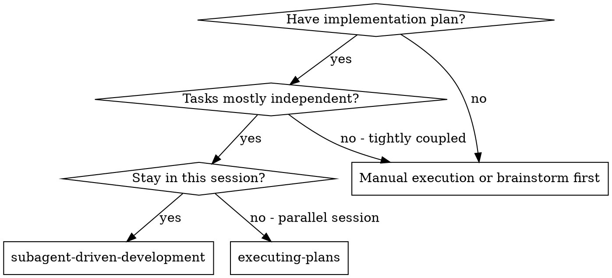

# Subagent-Driven Development

Execute plan by dispatching fresh subagent per **Phase**, with spec + code quality review after each Phase completes.

**Core principle:** Fresh subagent per Phase + two-stage review (spec then quality) = high quality, context-efficient execution

**Key change from task-level:** Each subagent handles an entire Phase (2-6 tasks), not individual tasks. This reduces dispatch overhead while maintaining fresh context.

**Checkpoint Mode:** This skill supports two modes:
- **Autonomous (checkpoint OFF)** - Runs all Phases without stopping for human input
- **Checkpoints (checkpoint ON)** - Pauses after each Phase for human approval before proceeding

## When to Use



**Comparison of execution modes:**

| Factor | Autonomous | Checkpoints | Batch Review |
|--------|------------|-------------|--------------|
| Skill | subagent-driven | subagent-driven | executing-plans |
| Session | Same | Same | Separate (worktree) |
| Dispatch unit | Phase | Phase | Phase |
| Human stops | None | After each Phase | After each Phase |
| Reviews | Automated (subagents) | Automated (subagents) | Human |
| Context | Fresh per Phase | Fresh per Phase | Accumulates |
| Speed | Fastest | Medium | Slowest |
| Best for | Independent Phases, trust process | Want oversight per Phase | Complex/risky changes |

## The Process

```
Read plan, extract all Phases with full content
    ↓
Create TodoWrite with Phases (not individual tasks)
    ↓
For each Phase:
    ↓
    Mark Phase as in_progress
        ↓
    Dispatch implementer subagent with FULL Phase content
    (all tasks, all steps, all code - subagent executes sequentially)
        ↓
    Subagent executes all Tasks in Phase using TDD
    (commits after each Task within the Phase)
        ↓
    Subagent completes, returns summary
        ↓
    Dispatch spec reviewer for entire Phase
        ↓
    [If issues] Dispatch fix subagent → re-review
        ↓
    Dispatch code quality reviewer for entire Phase
        ↓
    [If issues] Dispatch fix subagent → re-review
        ↓
    Mark Phase complete in TodoWrite
        ↓
    [If checkpoint mode] Report to user, wait for approval
        ↓
Next Phase
    ↓
All Phases complete → harness:finishing-a-development-branch
```

**Per-Phase flow details:**

1. **Extract Phase content:** Read all tasks, steps, code snippets for this Phase
2. **Dispatch implementer:** Give subagent the complete Phase specification
3. **Subagent executes:** Works through tasks sequentially, using TDD, commits per task
4. **Spec review:** Verify all tasks in Phase meet spec requirements
5. **Quality review:** Verify code quality across all Phase changes
6. **Checkpoint (if enabled):** Pause for human approval before next Phase

## Prompt Templates

- `./implementer-prompt.md` - Dispatch implementer subagent
- `./spec-reviewer-prompt.md` - Dispatch spec compliance reviewer subagent
- `./code-quality-reviewer-prompt.md` - Dispatch code quality reviewer subagent

## Example Workflow

```
You: I'm using Subagent-Driven Development to execute this plan.

[Read plan file: .harness/004-world-design/plan.md]
[Extract all 6 Phases with full content]
[Create TodoWrite with 6 Phase items]

Phase 1: Camera System (3 tasks)

[Mark Phase 1 as in_progress]
[Dispatch implementer subagent with full Phase 1 content]

Implementer: "Before I begin - should camera lerp be configurable?"

You: "Use 0.08 for now, we can make it configurable later"

Implementer: "Got it. Implementing Phase 1..."
[Later] Implementer:
  - Task 1.1: Camera follow - done, committed
  - Task 1.2: Zoom levels - done, committed
  - Task 1.3: Parallax fix - done, committed
  - All tests passing
  - Phase 1 complete

[Dispatch spec reviewer for Phase 1]
Spec reviewer: ✅ All 3 tasks meet spec requirements

[Dispatch code quality reviewer for Phase 1]
Code reviewer: ✅ Clean implementation, approved

[Mark Phase 1 complete]
[If checkpoint mode: "Phase 1 complete. Continue to Phase 2?"]

Phase 2: World Expansion (2 tasks)
...continues same pattern...
```

## Checkpoint Mode

When checkpoint mode is ON, pause after each Phase completes (after code quality review passes):

**Report format:**
```
✅ Phase N complete: [Phase name]

**What was implemented:**
- Task N.1: [summary]
- Task N.2: [summary]
- [Files modified]

**Verification:**
- Tests: [passing/failing]
- Spec review: ✅ Approved
- Code quality: ✅ Approved

**Commits:** [list of commit SHAs from this Phase]

---
Ready to proceed to Phase N+1: [Next phase name]?
[Continue / Pause / Adjust]
```

**User responses:**
- **Continue** - Proceed to next Phase
- **Pause** - Stop execution, user will resume later
- **Adjust** - User provides feedback, dispatch fix subagent before proceeding

**When to use checkpoint mode:**
- First time using subagent-driven on a codebase
- Complex or risky changes
- Learning how the automated reviews work
- Want to verify quality gates are catching issues

**When to skip checkpoints (autonomous mode):**
- Confident in the plan and process
- Independent, well-defined Phases
- Time-sensitive execution
- Established trust in automated reviews

## Handling Mixed Dependencies

When plans contain both independent and dependent Phases:

1. **Identify groups**: Find dependency chains (e.g., Phase 3 depends on Phase 2) vs. independent Phases
2. **Execute dependent chains sequentially**: Phases must execute in order when dependencies exist
3. **Independent Phases get fresh subagents**: Each Phase gets its own subagent
4. **Strategy**: Execute Phases in plan order (Phases are typically ordered by dependency)

**Note**: Within a Phase, tasks are executed sequentially by the same subagent. Phase-level is the dispatch boundary.

## Advantages

**vs. Manual execution:**
- Subagents follow TDD naturally
- Fresh context per Phase (no confusion from accumulated context)
- Parallel-safe (subagents don't interfere)
- Subagent can ask questions (before AND during work)

**vs. Batch Review (executing-plans):**
- Same session (no handoff)
- Fresh context per Phase (no accumulation)
- Automated spec + code quality reviews (consistent quality gates)
- Checkpoint mode gives human oversight without delays

**Efficiency gains:**
- No file reading overhead (controller provides full Phase content)
- Controller curates exactly what context is needed
- Subagent gets complete Phase information upfront
- Questions surfaced before work begins (not after)

**Quality gates:**
- Self-review catches issues before handoff
- Two-stage review: spec compliance, then code quality
- Review loops ensure fixes actually work
- Spec compliance prevents over/under-building
- Code quality ensures implementation is well-built

**Cost:**
- Subagent invocations (implementer + 2 reviewers per Phase)
- Controller does more prep work (extracting all Phases upfront)
- Review loops add iterations
- But catches issues early (cheaper than debugging later)

## Red Flags

**Never:**
- Skip reviews (spec compliance OR code quality) at Phase level
- Proceed to next Phase with unfixed issues
- Dispatch multiple Phase subagents in parallel (use sequential)
- Make subagent read plan file (provide full Phase content instead)
- Skip scene-setting context (subagent needs to understand where Phase fits)
- Ignore subagent questions (answer before letting them proceed)
- Accept "close enough" on spec compliance
- Skip review loops (reviewer found issues = fix = review again)
- Let implementer self-review replace actual review (both needed)
- **Start code quality review before spec compliance is ✅** (wrong order)
- Move to next Phase while current Phase has open review issues

**If subagent asks questions:**
- Answer clearly and completely
- Provide additional context if needed
- Don't rush them into implementation

**If reviewer finds issues:**
- Dispatch fix subagent with specific instructions
- Reviewer reviews again
- Repeat until approved
- Don't skip the re-review

**If subagent fails Phase:**
- Dispatch fix subagent with specific instructions
- Don't try to fix manually (context pollution)

## Integration

**Required workflow skills:**
- **harness:writing-plans** - Creates the plan this skill executes
- **harness:requesting-code-review** - Code review template for reviewer subagents
- **harness:finishing-a-development-branch** - Complete development after all tasks

**Subagents should use:**
- **harness:test-driven-development** - Subagents follow TDD for each task

**Alternative workflow:**
- **harness:executing-plans** - Use for separate session with batch-level human review (3 tasks at a time)
