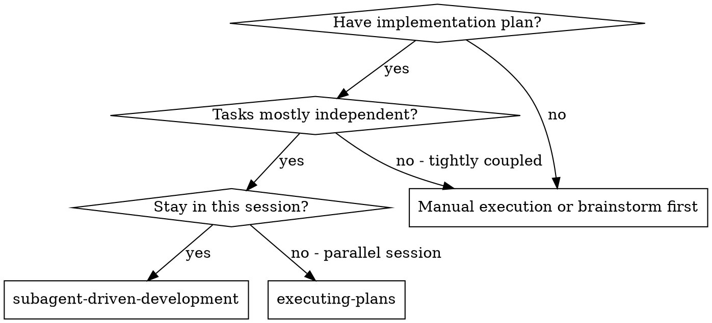
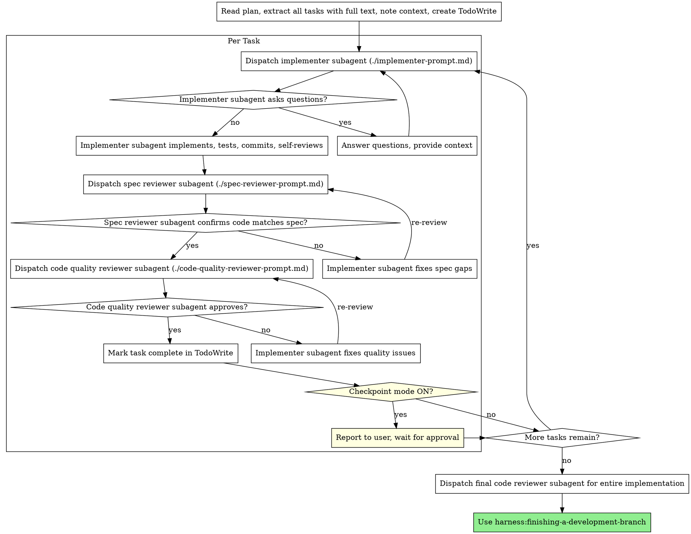

# Subagent-Driven Development

Execute plan by dispatching fresh subagent per **Phase**, with spec + code quality review after each Phase completes.

**Core principle:** Fresh subagent per Phase + two-stage review (spec then quality) = high quality, context-efficient execution

**Key change from task-level:** Each subagent handles an entire Phase (2-6 tasks), not individual tasks. This reduces dispatch overhead while maintaining fresh context.

**Checkpoint Mode:** This skill supports two modes:
- **Autonomous (checkpoint OFF)** - Runs all Phases without stopping for human input
- **Checkpoints (checkpoint ON)** - Pauses after each Phase for human approval before proceeding

## When to Use



**Comparison of execution modes:**

| Factor | Autonomous | Checkpoints | Batch Review |
|--------|------------|-------------|--------------|
| Skill | subagent-driven | subagent-driven | executing-plans |
| Session | Same | Same | Separate (worktree) |
| Human stops | None | After each task | After each batch (3 tasks) |
| Reviews | Automated (subagents) | Automated (subagents) | Human |
| Context | Fresh per task | Fresh per task | Accumulates |
| Speed | Fastest | Medium | Slowest |
| Best for | Independent tasks, trust process | Want oversight, catch issues early | Complex/risky changes |

## The Process



## Prompt Templates

- `./implementer-prompt.md` - Dispatch implementer subagent
- `./spec-reviewer-prompt.md` - Dispatch spec compliance reviewer subagent
- `./code-quality-reviewer-prompt.md` - Dispatch code quality reviewer subagent

## Example Workflow

```
You: I'm using Subagent-Driven Development to execute this plan.

[Read plan file once: docs/plans/feature-plan.md]
[Extract all 5 tasks with full text and context]
[Create TodoWrite with all tasks]

Task 1: Hook installation script

[Get Task 1 text and context (already extracted)]
[Dispatch implementation subagent with full task text + context]

Implementer: "Before I begin - should the hook be installed at user or system level?"

You: "User level (~/.config/harness/hooks/)"

Implementer: "Got it. Implementing now..."
[Later] Implementer:
  - Implemented install-hook command
  - Added tests, 5/5 passing
  - Self-review: Found I missed --force flag, added it
  - Committed

[Dispatch spec compliance reviewer]
Spec reviewer: ✅ Spec compliant - all requirements met, nothing extra

[Get git SHAs, dispatch code quality reviewer]
Code reviewer: Strengths: Good test coverage, clean. Issues: None. Approved.

[Mark Task 1 complete]

Task 2: Recovery modes

[Get Task 2 text and context (already extracted)]
[Dispatch implementation subagent with full task text + context]

Implementer: [No questions, proceeds]
Implementer:
  - Added verify/repair modes
  - 8/8 tests passing
  - Self-review: All good
  - Committed

[Dispatch spec compliance reviewer]
Spec reviewer: ❌ Issues:
  - Missing: Progress reporting (spec says "report every 100 items")
  - Extra: Added --json flag (not requested)

[Implementer fixes issues]
Implementer: Removed --json flag, added progress reporting

[Spec reviewer reviews again]
Spec reviewer: ✅ Spec compliant now

[Dispatch code quality reviewer]
Code reviewer: Strengths: Solid. Issues (Important): Magic number (100)

[Implementer fixes]
Implementer: Extracted PROGRESS_INTERVAL constant

[Code reviewer reviews again]
Code reviewer: ✅ Approved

[Mark Task 2 complete]

...

[After all tasks]
[Dispatch final code-reviewer]
Final reviewer: All requirements met, ready to merge

Done!
```

## Checkpoint Mode

When checkpoint mode is ON, pause after each task completes (after code quality review passes):

**Report format:**
```
✅ Task N complete: [Task name]

**What was implemented:**
- [Summary of changes]
- [Files modified]

**Verification:**
- Tests: [passing/failing]
- Spec review: ✅ Approved
- Code quality: ✅ Approved

**Commit:** [SHA] - [commit message]

---
Ready to proceed to Task N+1: [Next task name]?
[Continue / Pause / Adjust]
```

**User responses:**
- **Continue** - Proceed to next task
- **Pause** - Stop execution, user will resume later
- **Adjust** - User provides feedback, dispatch fix subagent before proceeding

**When to use checkpoint mode:**
- First time using subagent-driven on a codebase
- Complex or risky changes
- Learning how the automated reviews work
- Want to verify quality gates are catching issues

**When to skip checkpoints (autonomous mode):**
- Confident in the plan and process
- Independent, well-defined tasks
- Time-sensitive execution
- Established trust in automated reviews

## Handling Mixed Dependencies

When plans contain both independent and dependent tasks:

1. **Identify groups**: Find dependency chains (e.g., Task 5 depends on Task 3) vs. independent tasks
2. **Execute dependent chains sequentially**: Tasks 4 and 5 must wait for Task 3 to complete
3. **Independent tasks get fresh subagents**: Tasks 1, 2 can proceed without waiting
4. **Strategy**: Complete independent tasks first when possible, then tackle dependency chains in order

**Example**: Tasks 1, 2, 3 are independent; Tasks 4, 5 depend on 3. Execute 1, 2, 3 (fresh subagent each), then 4, then 5.

## Advantages

**vs. Manual execution:**
- Subagents follow TDD naturally
- Fresh context per task (no confusion)
- Parallel-safe (subagents don't interfere)
- Subagent can ask questions (before AND during work)

**vs. Batch Review (executing-plans):**
- Same session (no handoff)
- Fresh context per task (no accumulation)
- Automated spec + code quality reviews (consistent quality gates)
- Checkpoint mode gives human oversight without batch delays

**Efficiency gains:**
- No file reading overhead (controller provides full text)
- Controller curates exactly what context is needed
- Subagent gets complete information upfront
- Questions surfaced before work begins (not after)

**Quality gates:**
- Self-review catches issues before handoff
- Two-stage review: spec compliance, then code quality
- Review loops ensure fixes actually work
- Spec compliance prevents over/under-building
- Code quality ensures implementation is well-built

**Cost:**
- More subagent invocations (implementer + 2 reviewers per task)
- Controller does more prep work (extracting all tasks upfront)
- Review loops add iterations
- But catches issues early (cheaper than debugging later)

## Red Flags

**Never:**
- Skip reviews (spec compliance OR code quality)
- Proceed with unfixed issues
- Dispatch multiple implementation subagents in parallel (conflicts)
- Make subagent read plan file (provide full text instead)
- Skip scene-setting context (subagent needs to understand where task fits)
- Ignore subagent questions (answer before letting them proceed)
- Accept "close enough" on spec compliance (spec reviewer found issues = not done)
- Skip review loops (reviewer found issues = implementer fixes = review again)
- Let implementer self-review replace actual review (both are needed)
- **Start code quality review before spec compliance is ✅** (wrong order)
- Move to next task while either review has open issues

**If subagent asks questions:**
- Answer clearly and completely
- Provide additional context if needed
- Don't rush them into implementation

**If reviewer finds issues:**
- Implementer (same subagent) fixes them
- Reviewer reviews again
- Repeat until approved
- Don't skip the re-review

**If subagent fails task:**
- Dispatch fix subagent with specific instructions
- Don't try to fix manually (context pollution)

## Integration

**Required workflow skills:**
- **harness:writing-plans** - Creates the plan this skill executes
- **harness:requesting-code-review** - Code review template for reviewer subagents
- **harness:finishing-a-development-branch** - Complete development after all tasks

**Subagents should use:**
- **harness:test-driven-development** - Subagents follow TDD for each task

**Alternative workflow:**
- **harness:executing-plans** - Use for separate session with batch-level human review (3 tasks at a time)
