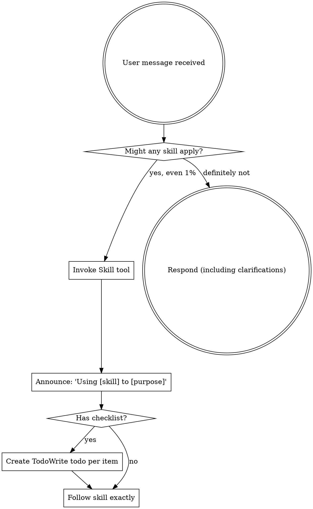

<EXTREMELY-IMPORTANT>
If you think there is even a 1% chance a skill might apply to what you are doing, you ABSOLUTELY MUST invoke the skill.

IF A SKILL APPLIES TO YOUR TASK, YOU DO NOT HAVE A CHOICE. YOU MUST USE IT.

This is not negotiable. This is not optional. You cannot rationalize your way out of this.
</EXTREMELY-IMPORTANT>

## How to Access Skills

**In Claude Code:** Use the `Skill` tool. When you invoke a skill, its content is loaded and presented to you—follow it directly. Never use the Read tool on skill files.

**In other environments:** Check your platform's documentation for how skills are loaded.

# Using Skills

## The Rule

**Invoke relevant or requested skills BEFORE any response or action.** Even a 1% chance a skill might apply means that you should invoke the skill to check. If an invoked skill turns out to be wrong for the situation, you don't need to use it.



## Session Start - Pending Execution Check

**Before any other action**, check for incomplete work using git:

```
On session start:
    ↓
Glob for .harness/*/plan.md
    ↓
For each plan.md found:
    ↓
    Check git log for "plan: abandoned" commit for this plan
    [If abandoned] → Skip this plan
    ↓
    Parse Phases count from plan header
    ↓
    Find commit that added plan.md:
    git log --diff-filter=A --format=%H -- <plan-path>
    ↓
    Count phase completions since plan creation:
    git log <sha>..HEAD | grep -E "^phase\([0-9]+\): complete$" | wc -l
    ↓
    Compare: completed phases vs total phases
    ↓
[If any plan has completed < total]
    ↓
    Display incomplete work info
    ↓
    Ask: "Resume? [Yes / No / Abandon]"
    ↓
    [Yes] → Read plan, determine next phase, invoke subagent-driven-development
    [No] → Continue normal session (will prompt again next session)
    [Abandon] → Create abandon commit, continue normal session
    ↓
[If all plans complete or no plans]
    ↓
    Normal using-harness behavior (check for applicable skills)
```

**Display format when incomplete work found:**

```
📋 **Incomplete work detected**

Feature: [feature name from plan path]
Progress: [X] of [Y] phases complete
Next: Phase [N]: [Phase name from plan]

Resume? [Yes / No / Abandon this plan]
```

**Handling responses:**
- **Yes**: Read plan, find next incomplete phase, invoke `harness:subagent-driven-development`
- **No**: Proceed with normal session, will prompt again next session
- **Abandon**: Create commit with `plan: abandoned` trailer, continue normal session

## Git Detection Edge Cases

| Case | Handling |
|------|----------|
| Plan exists but no commits since | All phases pending, prompt to resume |
| Plan file deleted but commits exist | Ignore (no plan to parse) |
| Multiple incomplete plans | Prompt for each, user chooses which to resume |
| Commit messages don't match convention | Count only exact matches, may under-count |
| Plan modified after phases started | Use current plan phase count |

**Abandon commit format:**

```bash
git commit --allow-empty -m "chore: abandon [feature-name] plan

plan: abandoned
Reason: [user-provided or 'No longer needed']"
```

## Red Flags

These thoughts mean STOP—you're rationalizing:

| Thought | Reality |
|---------|---------|
| "This is just a simple question" | Questions are tasks. Check for skills. |
| "I need more context first" | Skill check comes BEFORE clarifying questions. |
| "Let me explore the codebase first" | Skills tell you HOW to explore. Check first. |
| "I can check git/files quickly" | Files lack conversation context. Check for skills. |
| "Let me gather information first" | Skills tell you HOW to gather information. |
| "This doesn't need a formal skill" | If a skill exists, use it. |
| "I remember this skill" | Skills evolve. Read current version. |
| "This doesn't count as a task" | Action = task. Check for skills. |
| "The skill is overkill" | Simple things become complex. Use it. |
| "I'll just do this one thing first" | Check BEFORE doing anything. |
| "This feels productive" | Undisciplined action wastes time. Skills prevent this. |
| "I know what that means" | Knowing the concept ≠ using the skill. Invoke it. |
| "I know the current version" | Training data is outdated. Use researching skill. |
| "The API is probably..." | Never assume APIs. Research current docs. |

## Skill Priority

When multiple skills could apply, use this order:

1. **Research skills first** (researching) - verify current versions, APIs, best practices BEFORE making decisions
2. **Process skills second** (brainstorming, debugging) - these determine HOW to approach the task
3. **Implementation skills third** (writing-skills, subagent-driven-development) - these guide execution

"Let's build X" → researching + brainstorming first, then implementation skills.
"Fix this bug" → debugging first, then domain-specific skills.
"Add library X" → researching first to verify current version and usage patterns.

## Skill Types

**Rigid** (TDD, debugging): Follow exactly. Don't adapt away discipline.

**Flexible** (patterns): Adapt principles to context.

The skill itself tells you which.

## User Instructions

Instructions say WHAT, not HOW. "Add X" or "Fix Y" doesn't mean skip workflows.
