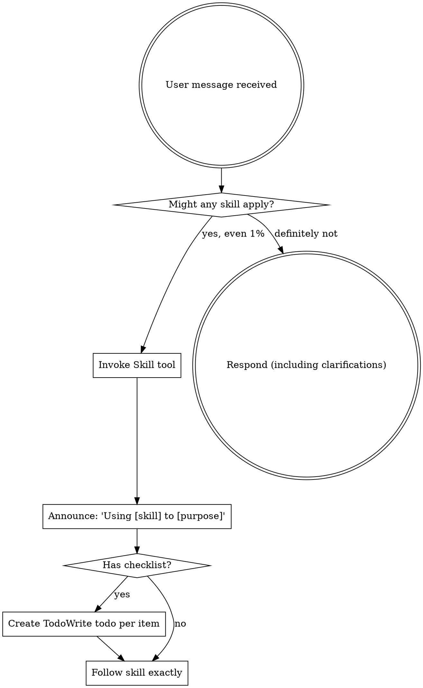

<EXTREMELY-IMPORTANT>
If you think there is even a 1% chance a skill might apply to what you are doing, you ABSOLUTELY MUST invoke the skill.

IF A SKILL APPLIES TO YOUR TASK, YOU DO NOT HAVE A CHOICE. YOU MUST USE IT.

This is not negotiable. This is not optional. You cannot rationalize your way out of this.
</EXTREMELY-IMPORTANT>

## How to Access Skills

**In Claude Code:** Use the `Skill` tool. When you invoke a skill, its content is loaded and presented to you—follow it directly. Never use the Read tool on skill files.

**In other environments:** Check your platform's documentation for how skills are loaded.

# Using Skills

## The Rule

**Invoke relevant or requested skills BEFORE any response or action.** Even a 1% chance a skill might apply means that you should invoke the skill to check. If an invoked skill turns out to be wrong for the situation, you don't need to use it.



## Session Start - Pending Execution Check

**Before any other action**, check for pending execution:

```
On session start:
    ↓
Check for .harness/PENDING_EXECUTION.md
    ↓
[If exists]
    ↓
    Read marker contents
    ↓
    Display pending execution info
    ↓
    Ask: "Resume execution? [Yes / No / Cancel]"
    ↓
    [Yes] → Invoke harness:subagent-driven-development or harness:executing-plans
    [No] → Continue normal session (marker remains for later)
    [Cancel] → Delete marker, continue normal session
    ↓
[If not exists]
    ↓
    Normal using-harness behavior (check for applicable skills)
```

**Display format when marker found:**

```
📋 **Pending execution detected**

Feature: [from plan path]
Progress: Phase [N] of [M] ([completed phases] ✓)
Mode: [autonomous/checkpoint]
Reason: [planning-complete/context-exhaustion/user-paused]

Resume execution? [Yes / No / Cancel pending]
```

**Handling responses:**
- **Yes**: Invoke appropriate skill with marker context, skill reads checkpoint and continues
- **No**: Proceed with normal session, marker stays for later resume
- **Cancel**: Delete marker file, proceed with normal session

## Red Flags

These thoughts mean STOP—you're rationalizing:

| Thought | Reality |
|---------|---------|
| "This is just a simple question" | Questions are tasks. Check for skills. |
| "I need more context first" | Skill check comes BEFORE clarifying questions. |
| "Let me explore the codebase first" | Skills tell you HOW to explore. Check first. |
| "I can check git/files quickly" | Files lack conversation context. Check for skills. |
| "Let me gather information first" | Skills tell you HOW to gather information. |
| "This doesn't need a formal skill" | If a skill exists, use it. |
| "I remember this skill" | Skills evolve. Read current version. |
| "This doesn't count as a task" | Action = task. Check for skills. |
| "The skill is overkill" | Simple things become complex. Use it. |
| "I'll just do this one thing first" | Check BEFORE doing anything. |
| "This feels productive" | Undisciplined action wastes time. Skills prevent this. |
| "I know what that means" | Knowing the concept ≠ using the skill. Invoke it. |
| "I know the current version" | Training data is outdated. Use researching skill. |
| "The API is probably..." | Never assume APIs. Research current docs. |

## Skill Priority

When multiple skills could apply, use this order:

1. **Research skills first** (researching) - verify current versions, APIs, best practices BEFORE making decisions
2. **Process skills second** (brainstorming, debugging) - these determine HOW to approach the task
3. **Implementation skills third** (writing-skills, subagent-driven-development) - these guide execution

"Let's build X" → researching + brainstorming first, then implementation skills.
"Fix this bug" → debugging first, then domain-specific skills.
"Add library X" → researching first to verify current version and usage patterns.

## Skill Types

**Rigid** (TDD, debugging): Follow exactly. Don't adapt away discipline.

**Flexible** (patterns): Adapt principles to context.

The skill itself tells you which.

## User Instructions

Instructions say WHAT, not HOW. "Add X" or "Fix Y" doesn't mean skip workflows.
